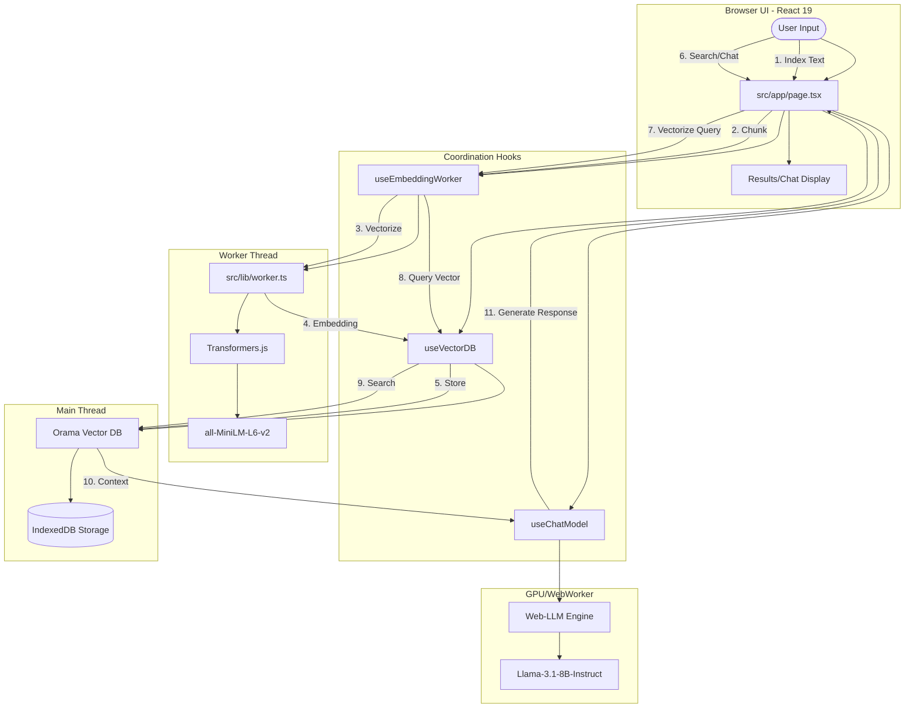

# System Architecture

This project implements a fully local, browser-native Retrieval-Augmented Generation (RAG) pipeline.

## High-Level Data Flow

## Component Breakdown

### 1. UI Layer (`src/app/page.tsx`)
The main entry point that manages tab state (Index, Search, Chat) and orchestrates the interaction between the different RAG hooks.

### 2. Embedding Worker (`src/lib/worker.ts`)
To prevent UI jank, all vectorization is offloaded to a Web Worker. It uses **Transformers.js** to run the `all-MiniLM-L6-v2` model. It handles both single query vectorization and batch processing for document chunks.

### 3. Vector Database (`src/hooks/useVectorDB.ts`)
Uses **Orama** to perform fast in-memory vector similarity searches.
- **Persistence:** Snapshots the database to **IndexedDB** using `idb-keyval` every time a document is indexed.
- **Retrieval:** On startup, it attempts to restore the state from the IndexedDB snapshot.

### 4. Chat Engine (`src/hooks/useChatModel.ts`)
Uses **Web-LLM** to run large language models (like Llama 3.1) directly in the browser using WebGPU. It receives retrieved context from the Vector DB and constructs a prompt for the local LLM to generate grounded answers.

### 5. Utilities (`src/utils/chunking.ts`)
Handles the sliding-window chunking logic to break down large documents into manageable pieces for embedding and retrieval.
