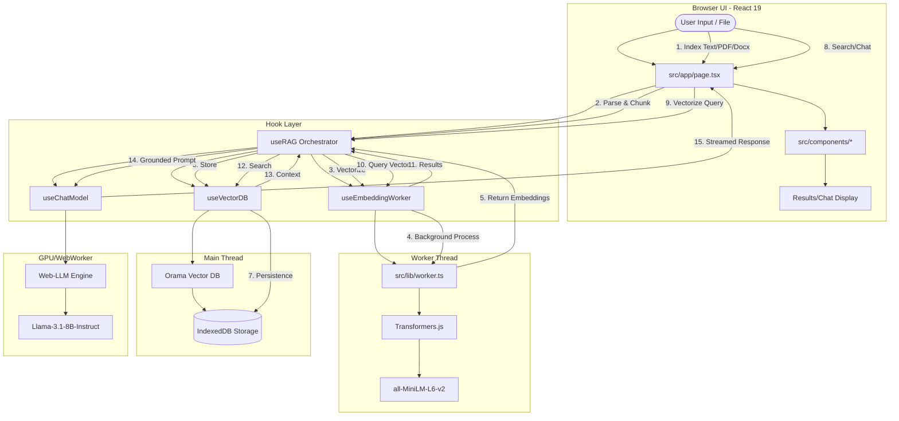

# System Architecture

This project implements a fully local, browser-native Retrieval-Augmented Generation (RAG) pipeline.

## High-Level Data Flow

## Component Breakdown

### 1. UI Layer (`src/components/`)
The UI is composed of decoupled React components that strictly handle presentation. 
- **IndexSection**: Handles text input and file uploads (PDF/Word).
- **ChatSection**: Handles user queries.
- **SourceGrid**: Displays evidence retrieved from the vector database.

### 2. Orchestrator Hook (`src/hooks/useRAG.ts`)
The `useRAG` hook is the central brain of the application. It coordinates the lifecycle of embeddings, database inserts, and LLM generation. It handles asynchronous events from the Web Worker and ensures state consistency across the RAG pipeline.

### 3. Embedding Worker (`src/lib/worker.ts`)
To prevent UI jank, all vectorization is offloaded to a Web Worker. It uses **Transformers.js** to run the `all-MiniLM-L6-v2` model. It handles both single query vectorization and batch processing for document chunks.

### 4. Vector Database (`src/hooks/useVectorDB.ts`)
Uses **Orama** to perform fast in-memory vector similarity searches.
- **Persistence:** Snapshots the database to **IndexedDB** using `idb-keyval` every time a document is indexed.
- **Retrieval:** On startup, it attempts to restore the state from the IndexedDB snapshot.

### 5. Chat Engine (`src/hooks/useChatModel.ts`)
Uses **Web-LLM** to run large language models (like Llama 3.1) directly in the browser using WebGPU. It receives retrieved context from the Vector DB and constructs a prompt for the local LLM to generate grounded answers.

### 6. Utilities (`src/utils/`)
- **chunking.ts**: Sliding-window logic for breaking text into overlapping segments.
- **fileParsing.ts**: Client-side extraction using `pdfjs-dist` and `mammoth`.
